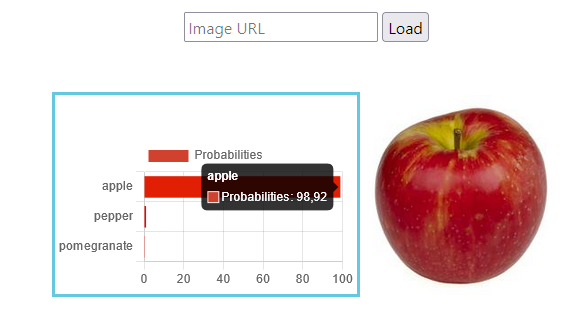

# Fruit recognition using Python and Flask

This project is a web application that recognizes fruits/vegetables.

# Data

Fruit images dataset was downloaded from [Kaggle](https://www.kaggle.com/datasets/kritikseth/fruit-and-vegetable-image-recognition). Dataset contains images of the following food items:

- Fruits:
  banana, apple, pear, grapes, orange, kiwi, watermelon, pomegranate, pineapple, mango

- Vegetables:
  cucumber, carrot, onion, potato, lemon, tomato, raddish, beetroot, cabbage, lettuce, spinach, soy bean, cauliflower, pepper, chilli pepper, turnip, corn, sweetcorn, sweet potato, jalepeño, ginger, garlic, peas, eggplant


## Features

- Detects the fruits in an image based on a provided URL.
- `fruit_recognition_model.ipynb` is the notebook file of the training
- `fruit_recognition_test.ipynb` is the notebook file in which the model is tested on a set from `images` folder
- `process_model.py` is a python file containing image processing, which will be loaded from a URL.
- `app.py`  is a python file, used to run Flask application.

## Technologies Used

- Python
- Flask (Web framework)
- tensorflow
- keras
- HTML/CSS

## Installation

1. Clone the repository:

    ```bash
    git clone https://github.com/your-username/fruit_recognition.git

2. Navigate to the project directory:

    ```bash
    cd fruit_recognition

3. Install the required dependencies:

    ```bash
    pip install -r requirements.txt

## Usage

1. Run the Flask application:

    ```bash
    python app.py

2. Open a web browser and go to http://localhost:5000.
3. Enter the URL of an image in the provided input field.
4. click the "Load" button to analyze the image and display the predicted fruit or vegetable.

## Screenshots

- Check model on test dataset


- Check model on different images 


- Check model on image from URL and show top 3 predicted classes




## License
MIT License